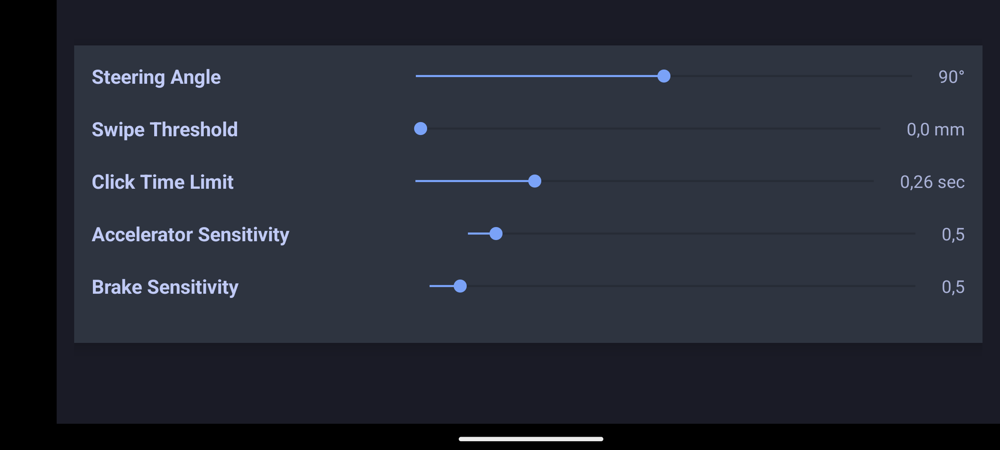

# MobileWheel
An app that simulates your phone as a steering wheel for PC.

# Python Server

The Python server in this project monitors commands sent from the client application and displays the corresponding logs in real-time. The server runs a graphical interface that allows you to start and stop the server, observe the status of various input commands (such as acceleration, braking, and steering), and view a live log of all actions performed by the server. This setup provides a straightforward way to manage and monitor the communication between the client and server.

# Android Client

### Menu
The main menu of the application provides a clean and user-friendly interface where users can easily navigate the core functionalities.

### Wheel

This interface allows users to control and monitor their driving inputs using their mobile device. The key features include:

- Accelerate and Brake: Users can press designated areas on the screen to accelerate or brake, with visual indicators showing the intensity of each action.
- Steering Control: The layout uses the device's motion sensors to interpret the tilt of the phone as steering input, allowing the user to steer as if turning a wheel.
- Button Controls: The screen includes four large buttons (Left Top, Left Bottom, Right Top, Right Bottom) and two extra buttons (Volume Up, Volume Down) for additional controls, which can be customized for different actions.

### Settings

This interface allows users to fine-tune various controls and sensitivities related to their driving experience. The settings available include:

- **Steering Angle:** Adjust the maximum steering angle using a slider. The current angle is displayed next to the slider.
- **Swipe Threshold:** Modify the swipe threshold, which determines how far the user needs to swipe to trigger an action. The threshold is adjustable via a slider, and the current value is shown in millimeters.
- **Click Time Limit:** Set the time limit for recognizing a click action, allowing users to control how quickly a tap is registered. The slider adjusts the time limit, and the current value is displayed in seconds.
- **Accelerator Sensitivity:** Adjust the sensitivity of the accelerator pedal, determining how responsive it is to user input. The current sensitivity level is shown next to the slider.
- **Brake Sensitivity:** Modify the sensitivity of the brake pedal, similar to the accelerator settings. The slider controls the sensitivity, and the current value is displayed.

